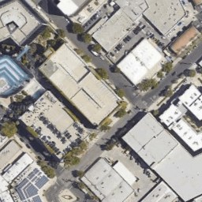
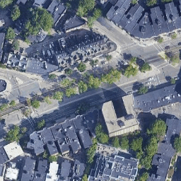
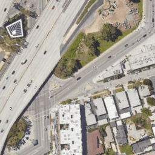

# Road Segmentation CIL

# Team Name - Kalakand
- Hardik Shah [hashah@ethz.ch]
- Ramanathan Rajaraman [rrajaraman@ethz.ch]
- Shaswat Gupta [shagupta@ethz.ch]
- Shrey Mittal [shmittal@ethz.ch]

# Optimizing Aerial Road Segmentation via Deep Learning and Multi-View Ensembling
Road segmentation from aerial imagery remains a critical challenge in computer vision, with wide-ranging applications in autonomous driving systems, urban planning, and environmental monitoring. We explore existing state-of-the-art segmentation models and present our empirical findings for generalization on the test dataset provided. We trained using a weighted combination of loss functions and achieved a public leaderboard score of 0.9258, demonstrating its effectiveness in accurate road extraction. The code and trained models are provided as supplementary material to facilitate further research and development in this area.

We present a collection of approaches to road segmentation using deep learning and analyse their strengths and shortcomings. Our model is based on an ensemble of segmentation models from the PyTorch Segmentation Library, a framework well-suited for image segmentation tasks. We have trained our model on a combination of large-scale satellite image datasets, carefully considering the challenges of high-resolution data, including increased noise due to the scaling and morphing and with a special focus on the similarity to the train set provided in the competition.

| Input Image | Ground Truth | Prediction Heatmap |
|-------------|--------------|--------------------|
|  |  |  |
|  |  |  |
|  |  |  |

# Installation
```
conda create --name cil python=3.9
conda activate cil
pip install -U segmentation-models-pytorch
pip install -U albumentations
pip install opencv-python
pip install wandb
pip install matplotlib
```

# Directory Structure
### Dataset Generation
```
pip install gdown
cd /datasets
bash ./download_data.sh
python data_generation.py
```

### Training
```
# For sample run use ./configs/base.yaml as your PATH_TO_CONFIG
python src/train.py --config=<PATH_TO_CONFIG>

# For sample run use ./configs/base.yaml as your PATH_TO_CONFIG
python src/train_finetune.py --config=<PATH_TO_CONFIG>
```

### Evaluation
You can Download the Best Weights we used for our submissions from https://polybox.ethz.ch/index.php/s/BOxZML55wTx7Rf8
```
# For sample run use ./configs/eval_base.yaml as your PATH_TO_CONFIG
python src/eval.py --config=<PATH_TO_CONFIG>

# For sample run use ./configs/eval_ha.yaml as your PATH_TO_CONFIG
python src/eval_ha.py --config=<PATH_TO_CONFIG>

# For sample run use ./configs/eval_ha_pad_fullres.yaml as your PATH_TO_CONFIG
python src/eval_ha_pad_fullres.py --config=<PATH_TO_CONFIG>

# For sample run use ./configs/eval_base.yaml as your PATH_TO_CONFIG
python src/eval_finetune.py --config=<PATH_TO_CONFIG>
```

### Models and Their (Used) Compatible Backbone Options
- DeepLabV3/DeepLabV3++:
    - tu-resnest50d
    - tu-resnest101e
    - tu-res2net101_26w_4s
    - tu-res2next50d
    - tu-res2next101e
    - tu-efficientnet-b6
- UNet/UNet++:
    - resnet34
    - resnet50
    - resnet101
    - resnext50_32x4d
    - efficientnet-b6
    - mobilenet_v2

### File Description
- **configs/**: Contains configuration files for setting hyperparameters and paths.
- **data/**: Contains the dataset files, including the raw zip file, training and test images, and corresponding text files listing the images.
- **mask_to_submission.py**: Converts segmentation masks to the submission format required for evaluation.
- **notebooks/**: Contains Jupyter notebooks for data exploration and analysis.
- **README.md**: Provides an overview of the project, setup instructions, and usage information.
- **scripts/**: Contains utility scripts, such as generating image lists from the dataset.
- **src/**: Contains the main source code for the project, including scripts for data loading, training, and evaluation.
- **submission_to_mask.py**: Converts the submission format back to segmentation masks for analysis.
- **utils/**: Contains utility functions and scripts for losses, metrics, and visualization.

# Results
| Loss     | Encoder   | F1   | Accuracy | mIoU | Precision |
|----------|-----------|------|----------|------|-----------|
| wBCE     | ResNet34  | 0.785 | 0.929    | 0.661 | 0.782     |
| wBCE     | ResNet50  | 0.789 | 0.931    | 0.671 | 0.776     |
| DICE+BCE | ResNet34  | 0.791 | **0.934**| **0.669** | **0.822** |
| **DICE+BCE** | **ResNet50** | **0.796** | **0.934** | **0.675** | 0.815 |
| Focal    | ResNet34  | 0.782 | 0.926    | 0.657 | 0.767     |
| Focal    | ResNet50  | **0.796** | 0.932 | **0.675** | 0.796 |
| -        | Combined  | 0.811 | 0.938    | 0.696 | 0.809     |


